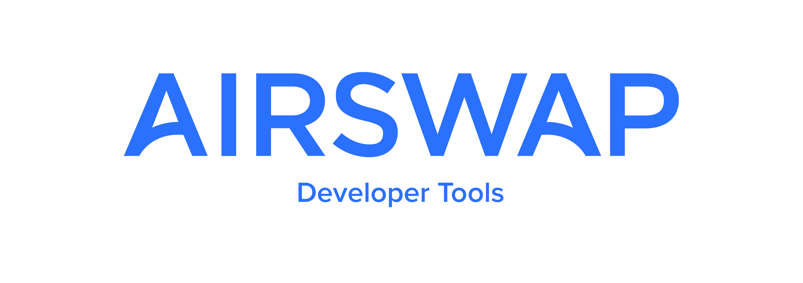

## What is AirSwap? {docsify-ignore-all}

[AirSwap](https://airswap.io/) is a peer-to-peer network for trading Ethereum ERC20 tokens. Peers connect to the marketplace and use the [Swap](https://swap.tech/whitepaper/) protocol to find and execute trades:

* Makers: provide liquidity in the form of quotes and signed orders
* Takers: send requests for quotes / orders and execute swaps

In general, Takers tend to use existing dApps for price discovery and execution, while Makers tend to use our APIs and libraries to provide liquidity. In order to better understand how most users will interact with the platform, let’s take a look at some dApps before diving into the API.

First, we'll look at the [AirSwap widget ⟶](dapps/widget.md)

!> The following APIs are in use in production on the AirSwap network. We are sharing these APIs and code samples publicly with our community to build and iterate on them. By connecting to and using the AirSwap services you accept the [AirSwap Terms of Use](https://swap.tech/airswap-terms-of-use.pdf). Please also be sure to review the [LICENSE](LICENSE.md).

## Join the Conversation

Be sure to join the AirSwap Developers Telegram group at https://t.me/airswapdevs or the AirSwap Community at https://t.me/airswap.
