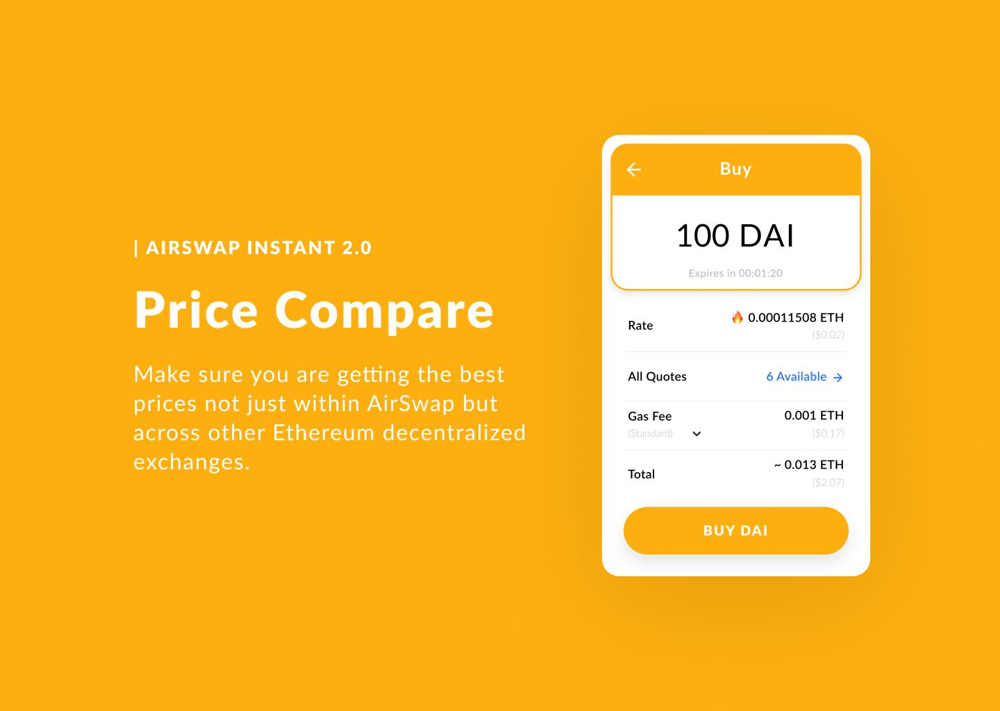
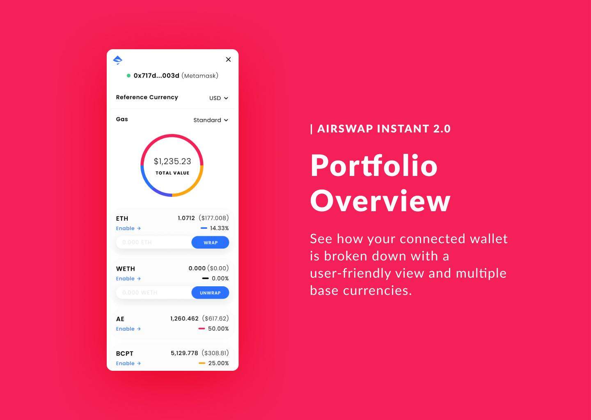
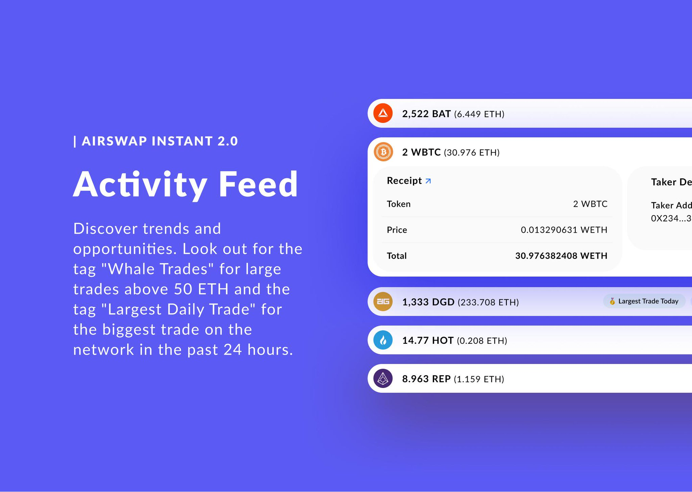
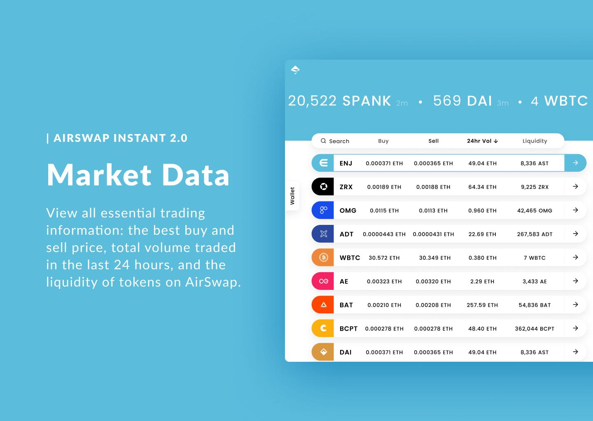

# Instant

AirSwap Instant combines portfolio functionality with global trading and liquidity statistics for the aggregate AirSwap trading network. Takers can request quotes and buy or sell from any connected Maker, and will automatically be presented with the best order available.

